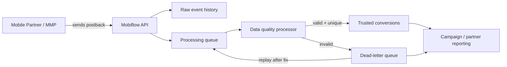
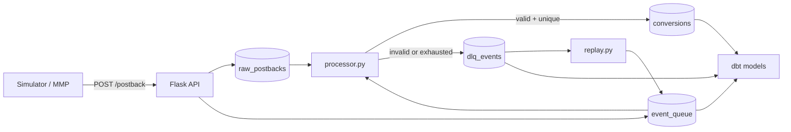

# Mobiflow Postback Pipeline

Postback ingestion pipeline for a mobile marketing scenario.

Partners/MMPs send conversion events to a Flask endpoint. The endpoint stores the raw payload, creates a queue item in Postgres, and returns fast. A Python processor picks up the queue, validates payloads, inserts trusted conversions, ignores duplicate deliveries, and sends bad events to a dead-letter table for inspection and replay.

I built this as a practical Data Engineering project around AdTech-style event ingestion, queue processing, data quality, and reporting.

---

## Architecture

### Business view



### Technical view



| Component | What it does |
|---|---|
| `ingestion/app.py` | Receives postbacks, stores raw JSON, creates queue items |
| `processing/processor.py` | Claims queue items, validates, deduplicates, writes conversions/DLQ |
| `processing/replay.py` | Re-enqueues DLQ events for another processing attempt |
| `simulator/generate_postbacks.py` | Generates valid, duplicate, and invalid MMP-like traffic |
| `analytics/dbt` | Builds staging models and reporting views |
| `sql/init.sql` | Creates the Postgres schema on first boot |

---

## Quickstart

```sh
cp .env.example .env
docker compose up --build -d
curl http://localhost:5000/health
```

Set up local Python for the simulator and worker:

```sh
python -m venv .venv
source .venv/bin/activate
python -m pip install --upgrade pip
python -m pip install -r requirements.txt
```

Send a batch of postbacks:

```sh
python simulator/generate_postbacks.py --total 500 --seed 42 --delay 0
```

Process the queue:

```sh
python -m processing.processor --once --batch-size 500
```

Run dbt:

```sh
docker compose run --rm dbt run
docker compose run --rm dbt test
```

---

## How the Pipeline Works

### 1. Ingestion

`POST /postback` accepts any valid JSON and returns `202`.

It does not reject business-invalid payloads like missing `click_id` or negative revenue. Those payloads are still useful for debugging and partner quality analysis, so they are stored first and judged later by the processor.

Malformed JSON is the one exception:

```text
not-json -> 400
{}       -> 202, then processor decides
```

### 2. Raw storage

Every accepted payload is written to `raw_postbacks`.

`raw_postbacks.id` is the internal receipt ID. `event_id`, when present, is just a partner/MMP-provided field. I do not use `event_id` as the main idempotency key in this demo.

### 3. Queue

Each raw postback gets one row in `event_queue`:

| Status | Meaning |
|---|---|
| `pending` | Waiting to be claimed |
| `processing` | Claimed by a worker |
| `done` | Processed or safely deduplicated |
| `failed` | Validation failure or retries exhausted |

The processor claims work with `FOR UPDATE SKIP LOCKED`, so multiple workers can poll without taking the same row.

### 4. Validation and DLQ

The processor validates the raw payload. Invalid events go to `dlq_events` with an error type, message, payload snapshot, and references back to the raw postback and queue item.

Current failure cases include:

- missing/empty/short `click_id`
- missing/invalid `event_type`
- missing `app_id`, `campaign_id`, or `partner_id`
- invalid/negative revenue
- invalid/future event time
- invalid currency, OS, or country
- non-object JSON payloads

### 5. Idempotency

Conversions are inserted with:

```sql
ON CONFLICT (click_id, event_type) DO NOTHING
```

The supporting constraint is:

```sql
UNIQUE (click_id, event_type)
```

So if a partner retries the same conversion delivery, the queue item is marked `done`, but no duplicate conversion row is created.

This key is good enough for this simulator because duplicate deliveries are generated from the same `click_id + event_type`. In a real production integration, I would confirm the partner contract before locking this in. Repeatable purchase events often need a more specific key such as `partner_id + event_id`, a transaction/order ID, or another event-level identifier.

### 6. Replay

Replay is for events that landed in DLQ but may become valid after a fix.

Examples:

- a validation rule was too strict;
- a processor bug was fixed;
- a transient database/schema issue was resolved;
- a partner clarified an event contract.

`replay.py` creates a new `pending` queue item for the same raw postback. It does not modify `raw_postbacks` and does not insert directly into `conversions`.

```sh
python -m processing.replay --all --limit 10 --dry-run
python -m processing.replay --error-type invalid_event_type --limit 5 --dry-run
python -m processing.replay --dlq-id 42
python -m processing.processor --once
```

---

## Manual API Examples

Valid postback:

```sh
curl -i -X POST http://localhost:5000/postback \
  -H "Content-Type: application/json" \
  -d '{
    "event_id": "evt_001",
    "click_id": "clk_demo_abc",
    "partner_id": "appsflyer",
    "app_id": "com.demo.wordpuzzle",
    "campaign_id": "camp_ios_us_cpi_burst_001",
    "publisher_id": "pub_ironSource_001",
    "event_type": "install",
    "event_revenue": 0,
    "event_currency": "USD",
    "country": "US",
    "os": "ios",
    "event_time": "2026-05-18T12:00:00+00:00"
  }'
```

Malformed JSON:

```sh
curl -i -X POST http://localhost:5000/postback \
  -H "Content-Type: application/json" \
  -d 'not-json'
```

Business-invalid JSON. Flask accepts it; the processor sends it to DLQ:

```sh
curl -i -X POST http://localhost:5000/postback \
  -H "Content-Type: application/json" \
  -d '{"click_id": "", "event_revenue": -5}'
```

---

## Simulator

The simulator generates a realistic mix:

```text
70% valid unique postbacks
15% duplicate deliveries
15% invalid payloads
```

Example:

```sh
python simulator/generate_postbacks.py --total 1000 --seed 42 --delay 0
```

With a fixed seed, the run is reproducible. Without a seed, it behaves like a fresh traffic sample.

---

## dbt Models

The dbt project is under `analytics/dbt`.

Staging:

- `stg_raw_postbacks`
- `stg_event_queue`
- `stg_conversions`
- `stg_dlq_events`

Marts:

- `fct_conversions`
- `rpt_campaign_performance`
- `rpt_partner_quality`
- `rpt_queue_health`
- `rpt_dlq_errors`

Run:

```sh
docker compose run --rm dbt run
docker compose run --rm dbt test
```

---

## Useful Verification Queries

```sh
docker exec -it mobiflow_postgres psql -U mobiflow -d mobiflow
```

```sql
-- queue status
select status, count(*)
from event_queue
group by status
order by status;

-- conversion count and revenue
select count(*) as conversions,
       round(sum(event_revenue)::numeric, 2) as revenue_usd
from conversions;

-- DLQ by error type
select error_type, count(*)
from dlq_events
group by error_type
order by count(*) desc;

-- duplicate safety check
select count(*) as duplicate_conversion_keys
from (
    select click_id, event_type, count(*)
    from conversions
    group by click_id, event_type
    having count(*) > 1
) d;
```

---

## Project Structure

```text
ingestion/
  app.py              Flask API
  db.py               Postgres connection pool
  Dockerfile

processing/
  processor.py        Queue worker
  replay.py           DLQ replay utility

simulator/
  generate_postbacks.py

analytics/dbt/
  models/staging/
  models/marts/

sql/
  init.sql

docs/
  DESIGN_DECISIONS.md
  RUNBOOK.md
```

---

## Notes

Some choices here are local-first:

- Postgres is used as the queue so the full lifecycle is visible in SQL.
- The processor uses explicit SQL with psycopg 3 instead of an ORM.
- The Flask app stays permissive and fast; data quality decisions happen downstream.
- dbt models are views, which keeps local iteration simple.

For the reasoning behind those choices, see [Design Decisions](docs/DESIGN_DECISIONS.md).

For commands, debugging, replay, and demo steps, see [Runbook](docs/RUNBOOK.md).
